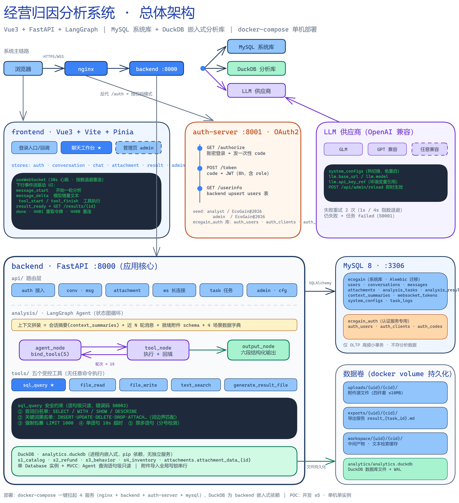

# 经营归因分析系统 功能规格说明（SPEC）

## 1. 文档信息

| 项 | 内容 |
| --- | --- |
| 文档名称 | 功能规格说明（含功能清单与实现设计） |
| 文档版本 | v1.0 |
| 创建日期 | 2026-08-16 |
| 上游文档 | `docs/PRD-经营归因分析系统.md`（v1.1） |
| 数据 companion | `docs/DATA-数据设计文档.md` |
| 接口 companion | `docs/API-接口设计文档.md`（前后端对接契约，接口字段以该文档为准） |
| 目标读者 | 前后端开发、测试 |

本文档将 PRD 的 F1–F10 功能域拆解为**可指派、可测试的功能点清单**，并给出每个模块的具体实现设计（流程、算法、约束、错误处理）。功能点 ID 规则：

- `AUTH-x`：认证服务与登录链路
- `CONV-x`：会话管理
- `MSG-x`：消息
- `ATT-x`：附件
- `WS-x`：实时通道
- `TASK-x`：分析任务
- `AGENT-x`：分析引擎与工具
- `RES-x`：结果
- `CTX-x`：上下文摘要
- `CFG-x`：配置与管理
- `FE-x`：前端功能点

## 2. 系统总体架构与模块划分

### 2.1 系统总体架构图



> 源文件：`docs/diagrams/system-architecture.excalidraw`（可用 [excalidraw.com](https://excalidraw.com) 打开编辑）。图中绿色区块为 DuckDB 嵌入式分析层（进程内、无独立服务），暗色区块为关键实现证据（WS 事件流、sql_query 安全约束、LLM 热切换配置）。

### 2.2 模块划分图（文本版）

```
┌────────────────────────── frontend（Vue3 + Vite）──────────────────────────┐
│ 授权登录入口页  登录回调页  聊天工作台（会话列表│对话区│结果区）  管理页      │
│ stores: auth / conversation / chat / attachment / result / admin           │
│ composables: useWebSocket（重连+心跳+消息分发）                             │
└───────────────┬──────────────────────────────────────────────┬────────────┘
                │ HTTPS REST                                    │ WSS
┌───────────────▼──────────────────────────────────────────────▼────────────┐
│ backend（FastAPI :8000）                                                    │
│ ┌─────────┐ ┌─────────┐ ┌─────────┐ ┌─────────┐ ┌─────────┐ ┌───────────┐  │
│ │ auth    │ │conv/msg │ │attach   │ │ws       │ │task     │ │admin/cfg  │  │
│ │ 接入    │ │会话消息 │ │附件     │ │长连接   │ │任务调度 │ │配置日志   │  │
│ └────┬────┘ └────┬────┘ └────┬────┘ └────┬────┘ └────┬────┘ └─────┬─────┘  │
│      │           │           │            │           │            │        │
│ ┌────▼───────────▼───────────▼────────────▼───────────▼────────────▼─────┐  │
│ │ analysis（LangGraph Agent：上下文拼装 → 工具循环 → 六段结构化输出）      │  │
│ │ tools: sql_query / file_read / file_write / text_search / gen_result   │  │
│ └────────────────────────────────────────────────────────────────────────┘  │
│ DuckDB（进程内嵌入式）                MySQL（系统库 ecogain）                │
└─────────────────────────────────────────────────────────────────────────────┘
┌── auth-server（FastAPI :8001，OAuth2 授权码：/authorize /token /userinfo）──┐
└────────────────────────────── MySQL（auth 库）──────────────────────────────┘
```

### 2.2 代码目录结构规划

```
ecogain/
├── docker-compose.yml
├── backend/
│   ├── app/
│   │   ├── main.py                 # FastAPI 入口、路由注册、启动恢复逻辑
│   │   ├── core/                   # 配置加载与热更新、日志、安全工具
│   │   │   ├── config.py           # SystemConfig 单例 + reload
│   │   │   ├── logging.py          # 结构化日志（trace_id 注入）
│   │   │   └── security.py         # 路径穿越校验、SQL 语句白名单
│   │   ├── api/                    # 路由层：auth / chat / attachment / admin / ws
│   │   ├── models/                 # SQLAlchemy 模型（10 张系统表）
│   │   ├── schemas/                # Pydantic DTO（对齐 DATA 文档）
│   │   ├── services/               # 业务层：conversation / message / attachment
│   │   │                            #   / task / result / summary / llm_gateway
│   │   ├── analysis/               # LangGraph Agent
│   │   │   ├── graph.py            # 状态图构建与流式事件映射
│   │   │   ├── state.py            # AnalysisState 定义
│   │   │   ├── context.py          # 上下文拼装
│   │   │   ├── output.py           # 六段结构化输出（Pydantic + 校验）
│   │   │   └── tools/              # 5 个工具实现
│   │   ├── ws/                     # connection_manager / 令牌 / 心跳 / 推送
│   │   └── db/                     # MySQL 引擎 / DuckDB 单例与读写锁
│   ├── alembic/                    # 系统库迁移
│   ├── seeds/                      # DuckDB 初始化脚本 + 演示附件样本
│   └── pyproject.toml
├── auth-server/
│   ├── app/main.py                 # OAuth2 三端点 + 登录页
│   └── ...
├── frontend/
│   ├── src/
│   │   ├── api/                    # axios 封装 + 各模块 API
│   │   ├── stores/                 # Pinia：auth/conversation/chat/attachment/result/admin
│   │   ├── composables/useWebSocket.ts
│   │   ├── components/             # 会话列表/消息气泡/任务进度/附件侧栏/结果六段
│   │   └── views/                  # Login / Callback / Workbench / Admin
│   └── ...
└── docs/
```

## 3. 功能点总清单

> P0 = M1/M2 里程碑必须交付；P1 = M3 内交付。

### 3.1 认证（AUTH）

| ID | 功能点 | 优先级 |
| --- | --- | --- |
| AUTH-1 | 认证服务 `GET /authorize`：展示账密登录页，校验 client_id/redirect_uri/response_type/state | P0 |
| AUTH-2 | 认证服务 `POST /token`：授权码换 access_token（JWT） | P0 |
| AUTH-3 | 认证服务 `GET /userinfo`：校验 token 返回用户信息 | P0 |
| AUTH-4 | 后端 `GET /auth/login`：生成 state 并 302 跳认证中心 | P0 |
| AUTH-5 | 后端 `GET /auth/callback`：state 校验、code 换 token、users upsert、签发会话 Cookie | P0 |
| AUTH-6 | 登录态校验中间件：未登录 API 返回 40101，页面重定向入口页 | P0 |
| AUTH-7 | 登出：清会话 Cookie，回授权登录入口页 | P0 |

### 3.2 会话与消息（CONV / MSG）

| ID | 功能点 | 优先级 |
| --- | --- | --- |
| CONV-1 | 创建会话（POST /api/chat/create） | P0 |
| CONV-2 | 会话列表（GET /api/chat/ls，last_message_at 倒序） | P0 |
| CONV-3 | 重命名（POST /api/chat/update） | P0 |
| CONV-4 | 删除（POST /api/chat/delete，软删会话 + 物理级联子资源 + 清磁盘目录） | P0 |
| CONV-5 | 归档（status 置 archived，列表默认不显示） | P1 |
| MSG-1 | 历史消息查询（GET /api/chat/ls/{id}，按 seq_no 排序） | P0 |
| MSG-2 | seq_no 原子分配（conversations.next_seq_no 自增） | P0 |
| MSG-3 | 发送限制：会话内存在 queued/running 任务时拒绝（40901） | P0 |

### 3.3 附件（ATT）

| ID | 功能点 | 优先级 |
| --- | --- | --- |
| ATT-1 | 上传（multipart，格式四件套 + ≤10MB 校验 + 文件名规范化） | P0 |
| ATT-2 | 异步解析调度（pending → parsing → ready/failed，后台 asyncio 任务） | P0 |
| ATT-3 | csv/xlsx → DuckDB 导入（attachment_data_{id} 动态建表） | P0 |
| ATT-4 | txt/md 注册文本检索（提取纯文本缓存至 workspace） | P0 |
| ATT-5 | 附件列表与状态查询（侧栏轮询 + WS 推送） | P0 |
| ATT-6 | 删除（DB 记录 + uploads 源文件 + DuckDB 表/检索缓存级联） | P0 |
| ATT-7 | 下载（路径穿越校验 + Content-Disposition 流式返回） | P0 |
| ATT-8 | 启动恢复：pending/parsing 附件置 failed | P0 |

### 3.4 实时通道（WS）

| ID | 功能点 | 优先级 |
| --- | --- | --- |
| WS-1 | 一次性令牌签发（POST /api/chat/ws-token，60s 有效） | P0 |
| WS-2 | 建连鉴权（令牌消费原子判定 + 归属校验，失败关闭码 4401） | P0 |
| WS-3 | 连接管理器（conversation_id → 连接集合；单用户单会话单连接） | P0 |
| WS-4 | 心跳（客户端 30s ping / 服务端 60s 容限断开） | P0 |
| WS-5 | 下行 8 类消息推送（对齐 PRD 附录 D） | P0 |
| WS-6 | 上行 user_message / cancel / ping 处理 | P0 |
| WS-7 | 断线重连补齐（REST 拉历史 + 重连后继续收事件） | P0 |

### 3.5 任务（TASK）

| ID | 功能点 | 优先级 |
| --- | --- | --- |
| TASK-1 | 任务创建（WS user_message 触发，五态状态机流转） | P0 |
| TASK-2 | 全局并发限制 ≤ 5（42901） | P0 |
| TASK-3 | 取消（cancel 上行 → asyncio 取消 + 终态 cancelled） | P0 |
| TASK-4 | 120s 硬超时熔断（50003） | P0 |
| TASK-5 | 僵尸恢复（启动扫描 queued/running 置 failed） | P0 |
| TASK-6 | task_logs 全生命周期记录 | P0 |
| TASK-7 | 任务查询（GET /api/tasks/{id}） | P0 |

### 3.6 分析引擎与工具（AGENT）

| ID | 功能点 | 优先级 |
| --- | --- | --- |
| AGENT-1 | LangGraph 分析图（plan → 工具循环 → 结构化收敛） | P0 |
| AGENT-2 | 上下文拼装（摘要 + 最近 N 轮 + 附件 schema 描述） | P0 |
| AGENT-3 | sql_query 工具（白名单 + LIMIT 包裹 + 10s 超时 + 禁多语句） | P0 |
| AGENT-4 | file_read / file_write 工具（目录白名单 + 限额） | P0 |
| AGENT-5 | text_search 工具（会话白名单文本关键词检索） | P0 |
| AGENT-6 | generate_result_file 工具（六段 → Markdown 落盘 exports） | P0 |
| AGENT-7 | 六段结构化输出（Pydantic 强校验，不合规即任务失败） | P0 |
| AGENT-8 | LLM 网关（OpenAI 兼容多供应商，配置热切换，失败重试 2 次） | P0 |
| AGENT-9 | 流式事件映射（astream_events → 8 类 WS 消息） | P0 |

### 3.7 结果与摘要（RES / CTX）

| ID | 功能点 | 优先级 |
| --- | --- | --- |
| RES-1 | 结果落库（结构化字段 + result_markdown 双存储） | P0 |
| RES-2 | 结果查询（GET /api/results/{task_id}） | P0 |
| RES-3 | 复制（前端 Markdown 组装到剪贴板） | P0 |
| RES-4 | 导出与重复下载（result_{task_id}.md） | P0 |
| CTX-1 | 压缩触发检查（>20 轮 或 >8k tokens） | P1 |
| CTX-2 | 区间摘要生成（LLM 压缩写 context_summaries，失败降级截断） | P1 |

### 3.8 配置与管理（CFG）

| ID | 功能点 | 优先级 |
| --- | --- | --- |
| CFG-1 | system_configs 读取与启动装载 | P0 |
| CFG-2 | 热更新（POST /api/admin/reload，重建 LLM client 与运行参数） | P0 |
| CFG-3 | 管理端任务日志查询 | P1 |
| CFG-4 | 数据源配置维护（DuckDB 路径等） | P1 |
| CFG-5 | 功能开关（feature 组：附件/导出启停） | P1 |
| CFG-6 | 管理接口 admin 角色拦截（40301） | P0 |

### 3.9 前端（FE）

| ID | 功能点 | 优先级 |
| --- | --- | --- |
| FE-1 | 授权登录入口页 | P0 |
| FE-2 | 登录回调页（错误展示 + 重试入口） | P0 |
| FE-3 | 会话列表侧栏（新建/切换/重命名/删除/归档） | P0 |
| FE-4 | 对话区（流式渲染、工具块、历史回放） | P0 |
| FE-5 | 实时任务区（状态/步骤/错误/工具过程进度） | P0 |
| FE-6 | 输入框（发送、运行中禁用、附件引用选择） | P0 |
| FE-7 | 附件侧栏（上传进度、状态流转、删除、下载） | P0 |
| FE-8 | 结果展示区（六段渲染、复制、导出） | P0 |
| FE-9 | WS 连接管理（令牌获取、心跳、指数退避重连） | P0 |
| FE-10 | 管理页（配置查看/重载、任务日志查询） | P1 |

## 4. 后端模块实现设计

### 4.1 AUTH 认证接入（AUTH-1~7）

**auth-server（独立 FastAPI 进程，端口 8001）**

- 端点：
  - `GET /authorize?client_id&redirect_uri&response_type=code&state`：渲染账密登录页（Jinja2 模板）。校验 client_id 已注册、redirect_uri 与注册值完全一致、response_type=code，任一不符返回 400 页面。登录提交（同路径 POST）校验账密（bcrypt），成功生成一次性授权码（`secrets.token_urlsafe(32)`，5 分钟有效，单次使用），302 回 `redirect_uri?code=...&state=...`；
  - `POST /token`（form：grant_type=authorization_code, code, client_id, client_secret）：校验授权码存在、未使用、未过期、client 匹配 → 标记已用 → 签发 JWT access_token（HS256，payload：`sub`（auth_users.id 字符串）、`username`、`display_name`、`role`、`exp` 8 小时）；
  - `GET /userinfo`（Bearer）：验签返回 payload。
- 表结构见 DATA 文档 auth 库（auth_users / auth_clients / auth_codes）。
- seed：`analyst / EcoGain@2026`、`admin / EcoGain@2026`；client 一条（client_id=ecogain-web，redirect_uri 指向 nginx 的 /auth/callback）。

**backend 侧**

- `GET /auth/login`：生成 `state = token_urlsafe(16)`，写入服务端暂存（内存 TTL dict，容器单实例内存即可，60 秒过期），302 至认证中心 /authorize；
- `GET /auth/callback?code&state`：
  1. 比对 state（不匹配/过期 → 40101 错误页）；
  2. `POST /token` 换 access_token → `GET /userinfo`；
  3. upsert `users`（按 external_user_id，status=disabled 则拒绝登录）；
  4. 签发会话：`session_token`（随机）写 HttpOnly+SameSite=Lax Cookie，服务端会话存内存 dict 含 user_id 与过期时间（24h）；
  5. 302 至工作台 `/workbench`。
- 登录态中间件：白名单路径（/auth/login、/auth/callback、/healthz、静态资源）外的 API 请求校验会话，失败返回 `{code: 40101}`；WS 建连走令牌鉴权（见 4.4）。
- 登出 `POST /auth/logout`：清 Cookie + 删除服务端会话。

### 4.2 CONV / MSG 会话与消息（CONV-1~5、MSG-1~3）

**创建（CONV-1）**：插入 conversations（status=active，title 缺省「新分析」，next_seq_no=0），返回 conversation_id/title/status。

**列表（CONV-2）**：`WHERE user_id=? AND status='active'`（归档入口再查 archived），`ORDER BY last_message_at DESC`。归档恢复（CONV-5）：archived → active。

**删除（CONV-4）**——严格按 PRD R1，单会话粒度事务 + 目录清理：

```python
async def delete_conversations(user_id, conversation_ids):
    # 1. 校验归属：不属于该 user 的 id 直接 40301（不部分执行）
    # 2. 若该会话存在 queued/running 任务 → 先触发取消，等待终态（≤5s）
    # 3. DB 事务（单会话粒度，失败回滚该会话并中止）：
    #    DELETE task_logs         WHERE task_id IN (SELECT id FROM analysis_tasks WHERE conversation_id=:cid)
    #    DELETE analysis_results  WHERE conversation_id=:cid
    #    DELETE analysis_tasks    WHERE conversation_id=:cid
    #    DELETE context_summaries WHERE conversation_id=:cid
    #    DELETE attachments       WHERE conversation_id=:cid   → 提交前取 file_path 列表
    #    DELETE messages          WHERE conversation_id=:cid
    #    UPDATE conversations SET status='deleted', updated_at=NOW(3) WHERE id=:cid
    # 4. 事务提交成功后清理磁盘（失败仅记 error 日志，不回滚 DB）：
    #    shutil.rmtree(uploads/{uid}/{cid}, exports/{uid}/{cid},
    #                  workspace/{uid}/{cid}, ignore_errors=True)
```

**seq_no 分配（MSG-2）**（MySQL 8 无 RETURNING，用锁定读）：

```sql
-- 同一事务内：
SELECT next_seq_no FROM conversations WHERE id = :cid FOR UPDATE;
-- 应用层 +1 后：
UPDATE conversations SET next_seq_no = :new_value WHERE id = :cid;
```

唯一索引 `(conversation_id, seq_no)` 兜底防重；冲突时重试一次分配。

**历史查询（MSG-1）**：按 conversation_id 查 messages `ORDER BY seq_no ASC`，用户消息聚合其 attachments（attachment.message_id 关联）。

### 4.3 ATT 附件（ATT-1~8）

**上传（ATT-1，POST /api/attachment/upload）**：

1. `feature.attachment_enabled` 开关检查（关闭 → 40301）；
2. 格式白名单（扩展名 + mimetype 双校验：csv/xlsx/txt/md）与 10MB 上限 → 40002；
3. 文件名规范化：`secure_filename`（去路径分隔符、`..`、控制字符）+ 冲突时追加短随机后缀；
4. 落盘 `uploads/{uid}/{cid}/{规范化名}`，插 attachments 行（parse_status=pending）；
5. `asyncio.create_task(parse_attachment(attachment_id))` 触发异步解析，立即返回 attachment_id。

**异步解析（ATT-2~4）**：

```python
async def parse_attachment(attachment_id):
    # 置 parsing；全程 try/except，任何异常 → failed（错误信息记入日志）
    # csv：pandas.read_csv(chunksize=50000，编码探测 utf-8 → gbk 降级)
    # xlsx：openpyxl 引擎读取首个 sheet
    # 列名规范化：小写、空白→下划线、非法字符剔除、空列名 col_{i}、重复列名追加 _2
    # DuckDB 导入：全局写锁内 CREATE TABLE attachment_data_{id} + 分批 INSERT
    # 脏数据容错：类型推断失败的列整体置 VARCHAR；行级解析失败跳过并计数
    # txt/md：提取纯文本 → workspace/{uid}/{cid}/attachment_text_{id}.txt（供 text_search）
    # 置 ready；经 WS 推送 attachment_status 消息（协议扩展位），前端侧栏轮询兜底
```

**启动恢复（ATT-8）**：应用启动时 `UPDATE attachments SET parse_status='failed' WHERE parse_status IN ('pending','parsing')`。

**删除（ATT-6）**：删 DB 行 + uploads 源文件 + workspace 检索缓存 + `DROP TABLE IF EXISTS attachment_data_{id}`（全局写锁内）。

**下载（ATT-7）**：按 id 查归属 → 拼绝对路径 → `resolve()` 后校验仍位于 `uploads/{uid}/` 前缀内（路径穿越拦截）→ FileResponse（Content-Disposition 附件下载）。

### 4.4 WS 实时通道（WS-1~7）

**令牌（WS-1）**：`POST /api/chat/ws-token`（body: conversation_id）→ 校验会话归属 → `token = secrets.token_urlsafe(32)` 插 websocket_tokens（expires_at = now + 60s）→ 返回 token 与 expires_in。

**建连鉴权（WS-2）**——消费必须原子：

```sql
UPDATE websocket_tokens
SET consumed_at = NOW(3)
WHERE token = :t AND conversation_id = :cid AND user_id = :uid
  AND expires_at > NOW(3) AND consumed_at IS NULL;
-- affected_rows == 1 → 放行；否则关闭码 4401
```

**连接管理器（WS-3）**：

```python
class ConnectionManager:
    # key: conversation_id → dict[user_id, WebSocket]（POC 单实例内存版）
    # connect(): 同一 (cid, uid) 已有连接 → 关闭旧连接，保留最新（多标签页场景）
    # disconnect(): 摘除；broadcast(cid, message): 对该会话所有连接 json 推送
    #   推送异常的连接静默摘除；单连接 send 经 asyncio.Lock 串行化防交织
```

**心跳（WS-4）**：客户端每 30s 发 `{"type":"ping"}`，服务端即时回 `pong`；服务端每连接维护 last_active，后台巡检协程 60s 容限无任何帧 → close(4408)。

**上行处理（WS-6）**：

- `user_message`：① 会话状态 active；② MSG-3 检查（40901，经 WS 下发 error）；③ TASK-2 全局并发检查（42901）→ 进入 4.5 任务创建；
- `cancel`：校验 task 归属 → 触发 4.5 取消；
- `ping`：回 `pong`。

**断线重连（WS-7）**：重连由前端驱动（见 5.2 FE-9）；服务端保证：任务推送目标连接不存在时消息丢弃（不堆积），前端重连后以 `GET /api/chat/ls/{cid}` + `GET /api/tasks/{id}` 补齐终态。

### 4.5 TASK 任务（TASK-1~7）

**创建与执行（TASK-1）**：

```python
async def start_task(user, cid, text, attachment_ids):
    # 校验附件归属 + parse_status=ready（未就绪附件拒绝并提示）
    task = insert(analysis_tasks, status='queued', input_text=text)
    推送 message_start + task_status{queued}
    asyncio.create_task(run_task(task))          # 单实例内存调度（POC 不引队列中间件）

async def run_task(task):
    置 running/started_at，推送 task_status{running}
    try:
        await asyncio.wait_for(execute_analysis(task),
                               timeout=cfg.agent.task_timeout_seconds)
        置 success/finished_at；推送 task_status{success} → done
    except asyncio.TimeoutError:  置 failed(50003) → error → done
    except asyncio.CancelledError: 置 cancelled/finished_at → task_status{cancelled} → done; raise
    except Exception as e:        置 failed(error=str) → error → done
    finally: 写 task_logs 终态记录
```

**并发限制（TASK-2）**：创建前 `SELECT COUNT(*) FROM analysis_tasks WHERE task_status IN ('queued','running')` ≥ 5 → 42901。

**取消（TASK-3）**：内存表保存 task_id → asyncio.Task 映射；cancel 时 `task.cancel()`；执行链在 await 点（LLM 网关、SQL 执行）抛 CancelledError 中断；LangGraph 执行随协程取消直接终止，已落库消息保留。

**超时（TASK-4）**：`asyncio.wait_for` 整体包裹（120s，配置可调）；超时时同样取消内部协程。

**僵尸恢复（TASK-5）**：`main.py` 启动事件中：

```sql
UPDATE analysis_tasks SET task_status='failed',
  error_message='服务重启导致任务中断', finished_at=NOW(3)
WHERE task_status IN ('queued','running');
```

**日志（TASK-6）**：run_task 全路径埋点：llm_call（模型、耗时、token 用量）、tool_exec（工具名、状态、耗时、结果摘要 ≤500 字）、status（状态流转）、summary（摘要触发）；log_level 按结果定 info/warn/error。

### 4.6 AGENT 分析引擎（AGENT-1~9）

**LangGraph 状态图（AGENT-1）**：

```
                    ┌──────────────┐
   上下文拼装 ─────▶ │  agent_node  │ bind_tools(5 工具)
  (context.py)      └──────┬───────┘
                     has_tool_calls? ──yes──▶ tool_node ──┐
                           │ no                         │（结果回填 messages）
                           ▼                            │
                    ┌──────────────┐                    │
                    │ output_node  │ ◀── 工具轮次 < max_tool_rounds（默认 15）
                    └──────────────┘     超限 → 注入收敛指令，强制无工具输出
```

- State（完整定义见 DATA 文档 §6.4）：messages、task_id、conversation_id、user_id、attachment_schemas、tool_rounds、final_result；
- agent_node：LLM 网关调用（tools 绑定）；tool_node：逐个执行工具、结果作为 ToolMessage 回填；
- 收敛条件：无 tool_calls，或达到 max_tool_rounds（此时追加一条「基于已有证据收敛输出」的 system 指令再做最后一次无工具调用）。

**上下文拼装（AGENT-2，context.py）**：

```
[system prompt]  角色设定 + 工具使用规范 + 六段输出契约 + 安全约束声明
[会话摘要]      context_summaries 按 created_at 序拼接（CTX-2 产出）
[最近 N 轮]     N = cfg.agent.context_rounds（默认 20 轮）原始消息
[本轮输入]      用户问题 + 就绪附件清单：
                  - 结构化附件：表名 attachment_data_{id} + 列名/类型/行数
                  - 文本附件：文件名 + 前几行预览（≤200 字）
[数据源说明]    4 个场景 schema 的表清单与列描述（静态注册，供 LLM 写 SQL）
```

**sql_query（AGENT-3，安全实现为核心）**：

```python
def validate_sql(sql: str) -> str | SqlRejected:
    s = 去注释（-- 与 /* */）、去首尾空白、压连续空白
    if ';' in s.rstrip(';'):        return 拒绝（多语句）   # 仅尾部分号放行
    首词 must ∈ {SELECT, WITH, SHOW, DESCRIBE, DESC}       # WITH 支持 CTE（漏斗/窗口必需）
    黑名单词（不区分大小写、词边界匹配）：
      INSERT|UPDATE|DELETE|MERGE|CREATE|ALTER|DROP|TRUNCATE|REPLACE|
      GRANT|REVOKE|ATTACH|DETACH|COPY|EXPORT|IMPORT|CALL|PRAGMA|INSTALL|LOAD
      → 命中即拒绝（错误码 50002，拒绝原因回传 Agent 供修正）
    return s

def wrap_limit(sql, max_rows=1000):
    # 语句已带 LIMIT n（n ≤ max_rows）→ 原样放行；否则外层包裹：
    return f"SELECT * FROM ({sql}) AS __limited__ LIMIT {max_rows}"
```

- 执行：DuckDB 上 `conn.execute(sql)` 包 `asyncio.wait_for(10s)`，超时/报错以错误文本回给 Agent（Agent 可修正 SQL 重试）；
- 返回值结构：`{columns, rows(≤1000), row_count, truncated}`，序列化为紧凑文本（列名 + 逐行）供 LLM 阅读；
- **DuckDB 连接策略（实现决策）**：backend 进程内维护**单一 `duckdb.Database` 实例**（analytics.duckdb，读写模式）。原因：附件导入（写）与 Agent 查询（读）同进程同文件，DuckDB 不允许同文件同时存在 read_only 与读写两种实例；进程内单实例由 MVCC 保证读写并发安全。PRD 所述「只读」以**语句级约束**落实：白名单 + 黑名单 + 查询专用 cursor；导入走全局 `asyncio.Lock` 串行写。

**file_read / file_write（AGENT-4）**：

- 公共守卫 `safe_path(user_id, conversation_id, relative, roots)`：join + resolve 后必须位于 `uploads/{uid}/{cid}/` 或 `workspace/{uid}/{cid}/` 前缀内，否则 50002；
- file_read：单次 ≤ 1MB，超出返回前 1MB 并注明截断；
- file_write：仅 workspace 根；写前检查会话累计用量（遍历 workspace 目录 ≤ 50MB）超限拒绝。

**text_search（AGENT-5）**：检索范围 = 当前会话 txt/md 附件的提取文本 + workspace 内 .txt/.md（深度 ≤2，单文件 ≤5MB）；关键词/短语逐文件正则扫描（IGNORECASE），返回 `{file, line_no, snippet(±120 字), matches}`，单文件命中上限 50。

**generate_result_file（AGENT-6）**：输入 = 六段结构化 JSON（由 output_node 保证已生成）；按 DATA 文档 §6.3 Markdown 模板渲染 → 写 `exports/{uid}/{cid}/result_{task_id}.md` → 更新 analysis_results.result_file_path。

**六段结构化输出（AGENT-7，output.py）**：

- LLM `with_structured_output(AnalysisResultModel)`（Pydantic 模型，字段见 DATA §6.3）；
- 校验：key_metrics ≥1、evidence_list ≥1 且 confidence ∈ 枚举、next_actions ≥2 —— 不合规重试 1 次（附错误说明再生成），再失败 → 任务 failed（error=结构化输出不合规）；
- 校验通过 → 落库 analysis_results（结构化字段 + 渲染 result_markdown）→ 推送 result_ready。

**LLM 网关（AGENT-8，llm_gateway.py）**：

- 基于 OpenAI 兼容 SDK；按当前配置惰性构建 client 并缓存（provider/base_url/api_key/model/temperature 来自 cfg 组 `llm`）；
- reload（CFG-2）时弃缓存重建 → 下一轮分析即用新模型；
- 重试：LLM 调用异常（超时/5xx/限流）指数退避重试 2 次（1s/4s），仍失败抛出 → 任务 failed（50001）；重试过程记 task_logs（warn）。

**流式事件映射（AGENT-9）**：`graph.astream_events(state, version="v2")`：

| LangGraph 事件 | 映射 WS 消息 |
| --- | --- |
| on_chat_model_stream（text chunk） | message_delta |
| on_tool_start | tool_start（tool_name + 输入摘要） |
| on_tool_end | tool_finish（tool_status + 结果摘要） |
| 节点进入（自定义回调） | task_status.current_step：planning / querying / summarizing |

模型文本 chunk 落库策略：assistant 消息 seq_no 在流式开始时分配并 INSERT 空行，delta 累积至内存，任务终态时 UPDATE 最终内容（避免高频写库）。

### 4.7 RES / CTX 结果与摘要（RES-1~4、CTX-1~2）

- 落库与查询：见 DATA §5（analysis_results 一任务一行，UK task_id）；
- 复制（RES-3）：前端按 result_markdown 直接 `navigator.clipboard.writeText`；
- 导出（RES-4）：导出按钮 → `GET /api/results/{task_id}/download`：若 result_file_path 已存在且文件在 → 直接返回流；否则后端补渲染（复用 generate_result_file 的渲染函数，不经过 Agent）再返回；下载守卫同 ATT-7 路径校验；
- CTX-1 触发检查：任务结束时计算（轮数 = 会话 messages 中 role=user 计数；token 估算 = 拼装上下文字符数 / 3）；
- CTX-2 摘要生成：取未被任何摘要覆盖的最早连续区间（≤10 轮/次）→ LLM 压缩（保留：结论、关键数值、用户约束偏好）→ 写 context_summaries → 被覆盖消息不再参与后续拼装；失败降级：直接按 seq_no 截断最旧消息 + task_logs warn。

### 4.8 CFG 配置与管理（CFG-1~6）

- 启动装载（CFG-1）：读 system_configs 全量 → 构建运行时配置对象（结构见 DATA §6.5）+ 缺省默认值合并；
- 热更新（CFG-2）：`POST /api/admin/reload` → 重新读表 → 原子替换配置引用（写锁）→ llm_gateway 缓存失效 → 返回 `{status:'ok', message:'重载 N 项配置'}`；reload 校验失败（如 llm.base_url 非法）返回 status=error 与原因，旧配置继续生效；
- 校验规则：llm.base_url 非空 + URL 格式；agent 数值项范围（timeout 30~600、max_tool_rounds 5~50、context_rounds 5~100）；
- 日志查询（CFG-3）：`GET /api/admin/tasks/{task_id}/logs` 按 created_at 升序返回；
- 开关（CFG-5）：feature 组当前定义 `feature.attachment_enabled`、`feature.export_enabled`（默认 true）；
- 权限（CFG-6）：admin 路由依赖项校验 `users.role == 'admin'`，否则 40301。

## 5. 前端模块实现设计

### 5.1 页面与路由

| 路由 | 视图 | 要点 |
| --- | --- | --- |
| `/login` | 授权登录入口页（FE-1） | 无登录态自动跳到此；「授权登录」按钮 → `location.href = '/auth/login'` |
| `/auth/callback` | 登录回调页（FE-2） | 展示 loading；URL 含 error 参数时展示原因 + 重试按钮 |
| `/workbench` | 聊天工作台（FE-3~8） | 三栏布局：左 260px 会话列表 / 中自适应对话区 / 右 360px 结果区；<1366px 时结果区折叠为抽屉 |
| `/admin` | 管理页（FE-10） | 仅 admin 可见入口；配置表单 + reload 按钮 + 任务日志查看器 |

### 5.2 关键实现

**useWebSocket composable（FE-9）**：

```typescript
// 状态机：idle → connecting → open → closed(reconnecting)
// connect(conversationId)：
//   1. POST /api/chat/ws-token → { websocket_token, expires_in }
//   2. new WebSocket(`${WS_BASE}/api/chat/ws/chat?websocket_token=..&conversation_id=..`)
//   3. onopen → 启动 30s ping 定时器
//      onclose(code=4401) → 重新取 token 再连；其他 close → 指数退避重连
//      （1s/2s/4s/8s，上限 30s，连续失败 10 次提示网络异常）
//   4. onmessage → JSON.parse → 按 type 分发到 chatStore/taskStore/resultStore/attachmentStore
// 会话切换：close 当前 → connect 新会话（重取令牌）
```

**chatStore（FE-4、FE-6）**：

- 发送：`ws.send({type:'user_message', text, attachment_ids})`；本地立即渲染用户气泡（乐观更新）；
- message_delta 累积到当前 assistant 气泡（增量 append，自动滚动跟随，用户上滚时暂停跟随）；
- tool_start/tool_finish 渲染为可折叠工具块（图标 + 工具名 + 状态 + 结果摘要）；
- error 消息渲染为红色错误条 + 「重试」按钮（重新发送上一问题）；
- 运行中（message_start 至 done/error）输入框禁用，发送键切换为「取消」（发 `{type:'cancel', task_id}`）；
- 切换会话 / 刷新页面：`GET /api/chat/ls/{cid}` 回放历史，进行中任务经 `GET /api/tasks/{id}` 补状态。

**taskStore（FE-5）**：task_status 驱动实时任务区——状态徽标（五态五色）、current_step 文案映射（planning=规划分析路径 / querying=查询取证 / summarizing=归纳结论）、错误信息展示、工具执行时间线（tool_start/finish 顺序列表 + 耗时）。

**resultStore（FE-8）**：result_ready → `GET /api/results/{task_id}` → 六段渲染：关键指标与证据列表为表格（confidence 三档色点），其余为 Markdown 正文（marked 渲染 + DOMPurify 消毒）；历史轮次结果通过对话区 result 卡片点开回看；复制/导出按钮调用 RES-3/4。

**attachmentStore（FE-7）**：上传用 axios onUploadProgress 展示进度条；上传完成进入列表后 5s 间隔轮询 parse_status 直至 ready/failed（收到 WS attachment_status 消息则提前停止轮询）；失败标记红字 + 删除重传。

**conversationStore（FE-3）**：列表加载/新建/重命名（行内编辑）/删除（确认弹窗，提示将清除全部消息与附件）/归档；新建后自动切换并建立 WS。

**adminStore（FE-10）**：配置按 config_group 分组表单展示（llm/agent/datasource/feature），「保存并重载」提交后展示 reload 返回的 status/message；任务日志查看器：输入 task_id → 表格渲染 log_level/log_type/log_content/时间，error 行红色。

## 6. 关键端到端时序

### 6.1 一轮成功分析（全链路）

```
用户            前端               后端                     DuckDB/MySQL        LLM
 │ 输入问题+选附件 │                  │                          │                  │
 │──────────────▶│ ws user_message  │                          │                  │
 │               │────────────────▶│ MSG-3/并发检查            │                  │
 │               │                  │ 建任务(queued) → MySQL    │                  │
 │               │ ◀─ message_start │                          │                  │
 │               │ ◀─ task_status{queued}                     │                  │
 │               │                  │ 置 running               │                  │
 │               │ ◀─ task_status{running, planning}          │                  │
 │               │                  │ 上下文拼装（摘要+近N轮+附件schema）           │
 │               │                  │ ──────── agent_node ───────────────────▶    │
 │               │ ◀─ message_delta │ ◀────────── 流式文本 ──────────────────     │
 │               │                  │ tool_calls: sql_query     │                  │
 │               │ ◀─ tool_start    │ 校验+LIMIT 包裹 ──────▶ DuckDB 查询          │
 │               │ ◀─ tool_finish   │ ◀── rows ────            │                  │
 │               │ ◀─ message_delta │ （多轮工具循环…）         │                  │
 │               │                  │ ──── output_node：结构化输出 ───────────▶    │
 │               │                  │ ◀── AnalysisResult JSON ───────────────     │
 │               │                  │ 校验+落库 results → MySQL │                  │
 │               │ ◀─ result_ready  │                          │                  │
 │               │                  │ 渲染 md → exports/result_{task_id}.md       │
 │               │ ◀─ task_status{success} + done              │                  │
 │ 点击导出       │ GET results/{id}/download → 文件流          │                  │
```

### 6.2 附件上传解析

```
前端 ── multipart ──▶ /api/attachment/upload
                       ├─ 校验(格式/大小/开关) → 落盘 uploads/… → DB pending
                       ├─ 返回 attachment_id（立即）
                       └─ asyncio.create_task: parsing → DuckDB 建表导入（写锁）→ ready
前端轮询 parse_status + WS attachment_status → ready 后可在输入框引用
```

## 7. 非功能实现要点

- **结构化日志**：loguru（自定义 JSON sink + InterceptHandler 接管 uvicorn 标准日志）JSON 行式输出 stdout，字段：`ts/level/msg/trace_id/task_id/conversation_id/user_id/duration_ms`；trace_id 在 WS user_message 处生成（uuid4.hex[:12]）经 contextvars + patcher 随任务传播；禁止裸 print；
- **错误处理约定**：路由层统一异常处理器 → PRD 附录 C 响应包；未预期异常统一 code=50000 且日志带堆栈摘要，不向前端透出内部细节；
- **安全落点汇总**：SQL 白名单（4.6）、路径守卫（4.3/4.6）、会话归属校验（全部资源路由前置依赖）、OAuth state（4.1）、WS 一次性令牌（4.4）、admin 拦截（4.8）、附件 mimetype 双校验（4.3）；
- **优雅停机**：SIGTERM → 停止接收新任务 → 等待运行中任务（≤30s）→ 超时者置 failed（同僵尸恢复逻辑）→ 关闭 WS 连接 → 退出；
- **健康检查**：`GET /healthz`（无鉴权）：MySQL ping + DuckDB ping + LLM 配置存在性，供 compose 探针。

## 8. 里程碑与功能点映射

| 里程碑 | 覆盖功能点 |
| --- | --- |
| M1 基础框架 | AUTH-1~7、CONV-1~4、MSG-1~3、ATT-1~8、WS-1~7、FE-1~4/6~7/9、CFG-1/6 |
| M2 分析链路 | TASK-1~7、AGENT-1~9、RES-1~4、FE-5/8、CFG-2 |
| M3 场景演示 | CONV-5、CTX-1~2、CFG-3~5、FE-10、4 场景 seed 与提示词调优 |
| M4 打磨交付 | 全量验收清单回归、文档、安全自查 |

## 9. PRD 功能域追溯表

| PRD 功能域 | SPEC 功能点 | 实现设计章节 |
| --- | --- | --- |
| F1 认证登录 | AUTH-1~7、FE-1~2 | 4.1、5.1 |
| F2 会话管理 | CONV-1~5、FE-3 | 4.2、5.2 |
| F3 聊天工作台 | MSG-1~3、FE-4~6 | 4.2、5.2 |
| F4 附件管理 | ATT-1~8、FE-7 | 4.3、5.2 |
| F5 分析任务与引擎 | TASK-1~7、AGENT-1~9、FE-5 | 4.5、4.6 |
| F6 实时通道 | WS-1~7、FE-9 | 4.4、5.2 |
| F7 结构化结果 | RES-1~4、AGENT-6/7、FE-8 | 4.6、4.7、5.2 |
| F8 上下文摘要 | CTX-1~2、AGENT-2 | 4.7 |
| F9 系统管理 | CFG-1~6、FE-10 | 4.8、5.2 |
| F10 示例场景 | seed 数据（无独立功能点） | DATA 文档 §5、§8.1 |
